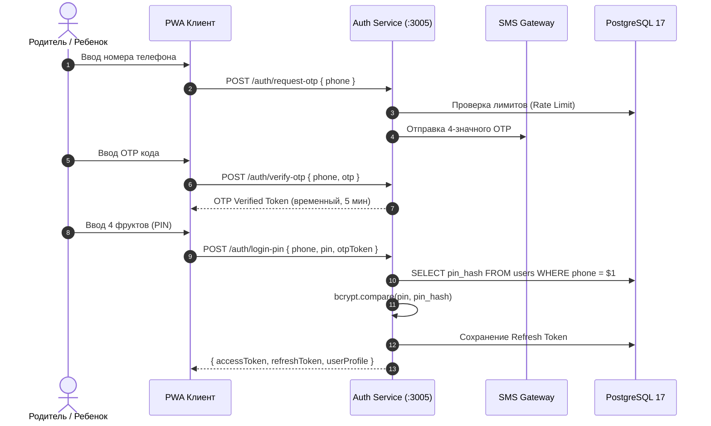

# Безопасность, Авторизация и Серверный Античит

## 1. Схема Двухфакторной Авторизации



### Требования к реализации
1. **Фруктовый PIN:** Представляет собой массив идентификаторов фруктов (например, `["apple", "banana", "cherry", "orange"]`). При сохранении преобразуется в каноническую строку и хэшируется через `bcrypt.hash(pinStr, 10)`.
2. **Token Blacklist:** При вызове `/auth/logout` токен записывается в таблицу `token_blacklist`:
   ```sql
   INSERT INTO token_blacklist (token, expires_at) VALUES ($1, $2);
   ```
   Мидлвар авторизации проверяет наличие токена в блэклисте перед пропуском любого запроса.

---

## 2. Античит и Валидация Наград

### Правила проверки мини-игры
Клиент при завершении сессии мини-игры отправляет:
```json
{
  "gameId": "catch",
  "sessionToken": "uuid-v4-from-start-session",
  "durationSeconds": 45,
  "score": 120,
  "eventsChecksum": "hash-of-action-timestamps"
}
```

Серверная валидация:
1. `sessionToken` должен существовать в базе/кэше и быть выдан не более чем `durationSeconds + 5` секунд назад.
2. Проверка теоретического максимума:
   - В игре «Поймай предмет» физически невозможно поймать более 2 фруктов в секунду.
   - `maxPossibleScore = durationSeconds * 2.5`.
   - Если `score > maxPossibleScore`, сессия помечается как подозрительная, награда обнуляется.
3. Начисление монет:
   ```sql
   UPDATE users 
   SET coins = coins + $1, updated_at = NOW() 
   WHERE id = $2;
   ```
