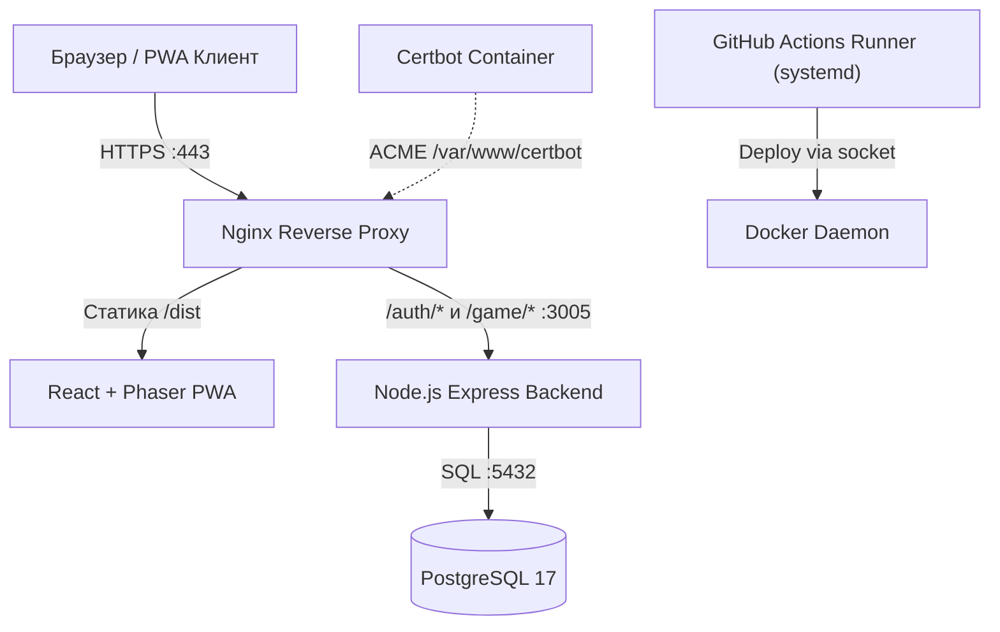

# Инструкция для ИИ-агентов (AGENTS.md)

> Прочитай этот файл в самом начале каждого нового диалога по проекту **Улиткроши**.
> Он содержит архитектуру, стек, инфраструктуру VDS, среду разработки и практические правила.

---

## 1. Описание проекта и текущее состояние

**«Улиткроши»** — детское игровое PWA-приложение (тамагочи, развивающие мини-игры, уход, эволюция, коллекция).
* **Целевая аудитория:** Дети 4–12 лет и их родители.
* **Develop / Staging стенд (демо Заказчику):** `https://ulitkroshi.intelcosystem.com`
* **Боевой сервер (Production):** Будет развернут позже на домене `ulitkroshi.ru`.
* **VDS сервер:** JMNext (`135.106.228.10`, Debian 13 trixie, non-root `sysop`, SSH-порт 22).
* **Рабочий репозиторий:** `git@github.com:JMNext/ulitkroshi.git` (ветка по умолчанию: `develop`).
* **Зеркало первоначальных разработчиков:** `origin/boss-main` (`boss/main`).
* **Стек бэкенда:** Исторически проект начинался на .NET 10 (архив в `backend/src/`), в актуальной версии 1.2+ переведен на монолит **Node.js 22 + Express + TypeScript** (`backend/server.ts`) с базой данных **PostgreSQL 17**.

---

## 2. Технологический стек

* **Frontend (PWA):** TypeScript 5.x, Vite 5.x, React 18.x, Phaser 3.x (2D Canvas движок, физика, анимации, мини-игры), Zustand 4.x, Axios 1.x, Service Worker, Web Speech API (голосовой ввод имени).
* **Backend:** Node.js 22 Alpine, TypeScript (`tsx`), Express 4.x (`backend/auth-service/`, `backend/game-service/`, `backend/shared/`).
* **База данных:** PostgreSQL 17 (`users`, `token_blacklist`), пул `pg`.
* **Безопасность:** Хэширование фруктовых пинов `bcrypt`, JWT access/refresh токены, rate limit начисления монет (античит).
* **Инфраструктура:** Nginx 1.27 Alpine (Reverse proxy, SSL Termination, HTTP/2, SPA-роутинг, кеш ассетов), Certbot (Let's Encrypt), Docker Compose v2 (`ulitkroshi-network`).

---

## 3. CI/CD и Автоматизация (GitHub Actions)

Пайплайн настроен в `.github/workflows/deploy.yml` на собственном раннере (`jmnext-vds-runner`, метки: `[self-hosted, linux, x64]`):
1. **Почему Self-Hosted Runner:**
   - *Безопасность:* Не нужно открывать SSH или Docker сокет в интернет.
   - *Скорость:* Сборка и запуск контейнеров локально на VDS без долгой передачи Docker-слоев по сети.
   - *Экономия:* 0 расхода бесплатных минут GitHub Actions.
   - *Изоляция:* Работает под systemd-сервисом пользователя `actions-runner` с автоперезапуском.
2. **Триггеры:**
   - `push` в ветку `develop`: автосборка фронтенда (`npm run build:front`), пересборка образов и деплой на staging.
   - Релизный тег `v*.*.*`: версионированный релиз.
   - `workflow_dispatch`: ручной запуск с опциональным флагом `skip_build`.

---

## 4. Особенности инфраструктуры и Gotchas

### 4.1. Запуск Ansible на файловой системе NTFS (WSL)
* Разработка ведется в WSL Ubuntu на NTFS (`/mnt/d/...`). На NTFS все файлы получают права `777` (world-writable).
* Ansible игнорирует `ansible.cfg` в world-writable каталогах.
* **Правило:** Всегда запускать Ansible с явным указанием переменной:
  ```bash
  ANSIBLE_CONFIG=./ansible.cfg ansible-playbook -i infrastructure/ansible/inventories/development/hosts infrastructure/ansible/playbooks/setup-server.yml
  ```

### 4.2. Особенности ОС Debian 13 (trixie) на VDS
* **Docker APT:** Для `trixie` репозиторий Docker еще не выпущен, используется кодовое имя `bookworm`.
* **Runner .NET Runtime:** Требует системный пакет `libicu-dev` (без него раннер падает с ошибкой глобализации).

### 4.3. Решение проблемы «курицы и яйца» Certbot + Nginx
* Nginx с SSL не может стартовать без сертификатов, а Certbot `--webroot` не может пройти ACME, если Nginx выключен.
* **Решение:** До запуска Compose раннер проверяет наличие сертификата Let's Encrypt через `openssl x509 -issuer`. При отсутствии/заглушке запускается временный `certbot certonly --standalone -p 80:80` на свободном порту. После чего стартует `docker compose up -d`, а дальнейшие продления идут через вебрут `/var/www/certbot`.

---

## 5. Архитектурная схема взаимодействия



---

## 6. Ключевые директории и файлы

```
.
├── backend/                        # Монолит Node.js 22 Express (TypeScript)
│   ├── auth-service/               # Роуты, валидация и сервис авторизации (JWT, bcrypt)
│   ├── game-service/               # Роуты и логика питомцев, мини-игр и наград
│   ├── shared/                     # db.ts (pg pool), middleware, утилиты
│   └── server.ts                   # Точка входа Express API (:3005)
├── frontend/                       # Клиент PWA (React 18 + Phaser 3 + Vite)
│   ├── src/game/scenes/            # Игровые сцены (Boot, Login, MainScene, 4 мини-игры)
│   ├── src/store/                  # Zustand сторы состояния
│   └── src/api/                    # Axios клиент и интерцепторы
├── deployment/                     # Docker Compose и конфигурации контейнеров
│   ├── docker-compose.yml          # Оркестрация postgres, backend, nginx, certbot
│   ├── backend.Dockerfile          # Multi-stage сборка Node.js 22 Alpine
│   ├── nginx/nginx.conf            # Конфиг Nginx (HTTP/2, SSL, кеш ассетов, прокси)
│   └── postgres/init.sql           # Схема БД (таблицы users, token_blacklist)
├── infrastructure/ansible/         # Настройка VDS хоста (роли common, docker, runner)
├── tasks/                          # Документы аудита, todo.md и lessons.md
└── AGENTS.local.md                 # Доступы, секреты и пароли (git-ignored)
```

---

## 7. Основные команды

```bash
# === ФРОНТЕНД ===
npm run dev                    # Запуск Vite локально (http://localhost:5173)
npm run build:front            # Сборка PWA фронтенда в dist/
npm run lint                   # Проверка линтером

# === БЭКЕНД ===
npm run dev:backend            # Запуск бэкенда через tsx watch (:3005)
npm run build:backend          # Сборка TypeScript бэкенда

# === ДЕПЛОЙ И ИНФРАСТРУКТУРА ===
docker compose -f deployment/docker-compose.yml up -d --build   # Локальный стек
# Запуск Ansible с учетом NTFS WSL:
ANSIBLE_CONFIG=./ansible.cfg ansible-playbook -i infrastructure/ansible/inventories/development/hosts infrastructure/ansible/playbooks/setup-server.yml
```

---

## 8. Регламент Git, версионирования и CHANGELOG.md

* **Ветки:**
  * `main` — Production (сборка только из этой ветки на домен `ulitkroshi.ru`).
  * `develop` — Staging / разработка (деплой на `ulitkroshi.intelcosystem.com`).
  * Рабочие ветки от `develop`: `feature/<имя>`, `fix/<имя>`, `hotfix/<имя>`, `chore/<имя>`, `docs/<имя>`.
* **Коммиты (Conventional Commits):**
  * Текущий формат: `<тип>(<область>): <описание>` (`feat`, `fix`, `chore`, `docs`, `refactor`).
  * При подключении трекера (Redmine): `[TICKET-ID] <тип>(<область>): <описание>` (например, `[ULIT-105] feat(auth): sms verification`).
* **Версионирование (SemVer):** `vMAJOR.MINOR.PATCH-b<BUILD>` (номер сборки `GITHUB_RUN_NUMBER` из CI). Теги: `stage_vX.Y.Z` (тест/демо), `vX.Y.Z` (релиз в `main`).
* **CHANGELOG.md:** Обязательно фиксировать все важные фичи, изменения и фиксы в `CHANGELOG.md` по стандарту Keep a Changelog (`[Unreleased]`, `[X.Y.Z]`).

---

## Управление задачами

1. **Сначала планирование**: Запиши план в файл `tasks/todo.md` с отмечаемыми пунктами
2. **Проверка плана**: Зафиксируй изменения перед началом реализации
3. **Отслеживание прогресса**: Отмечай выполненные пункты по мере продвижения
4. **Объяснение изменений**: Краткое описание каждого шага
5. **Документирование результатов**: Добавь раздел обзора в файл `tasks/todo.md`
6. **Извлечение уроков**: Обнови файл `tasks/lessons.md` после внесения исправлений

---

## Основные принципы

* **Простота прежде всего**: Делай каждое изменение максимально простым. Минимальные правки кода
* **Не ленись**: Находи первопричины. Никаких временных решений. Соответствуй практикам опытных разработчиков
* **Минимальное влияние**: Изменения должны затрагивать только необходимое

---

## Описание среды разработки:

* Разработка ведется в среде WSL Ubuntu 24.04, под управлением ОС Windows 11 Pro + WSL2
* Файловая система локального репозитория: NTFS
* AI-ассистент: Google Antigravity IDE 2.5.5
* **Принцип «чистой системы»:** Категорически запрещено устанавливать новые модули, пакеты или компоненты в операционную систему WSL Ubuntu 24.04 хоста без явного согласования. 
  * В WSL установлены только `git`, `docker`, `python`, `ansible`, `node`, `npm`.
  * Запрещается устанавливать компоненты в глобальном окружении python.
  * Для PHP/Go используются Docker псевдонимы (aliases). Установка их напрямую запрещена.
  * Для работы с базами данных MySQL и Postgres следует использовать временные Docker-контейнеры.

---

## Доступы и параметры подключения

* Хранятся локально в git-ignored файле `AGENTS.local.md`

---

## Техническое задание

Прочитай ТЗ в `initial_docs/technical_specification.md`

---
