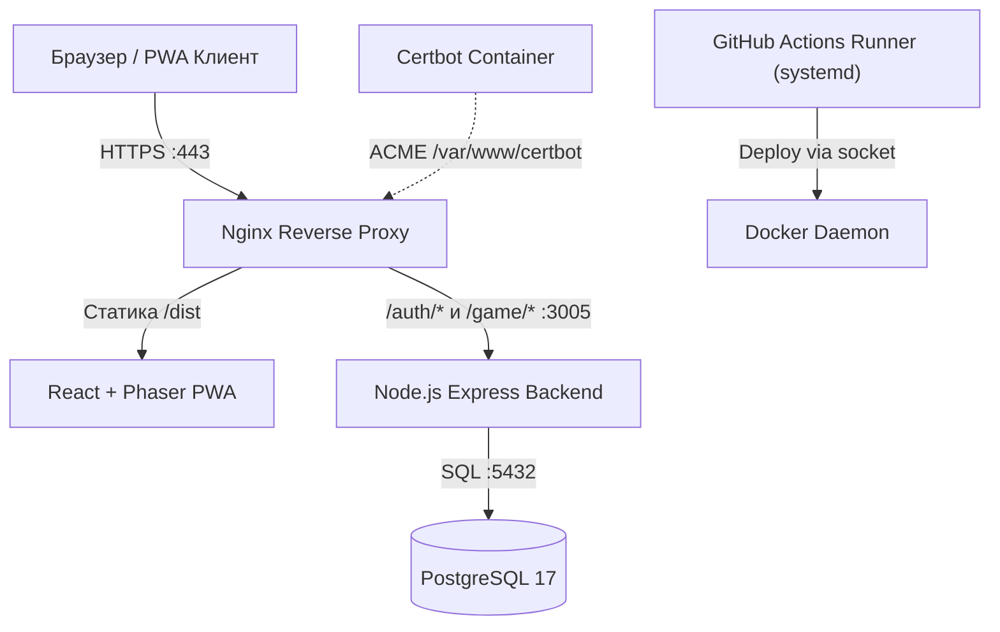

# Инструкция для ИИ-агентов (AGENTS.md)

> Прочитай этот файл в самом начале каждого нового диалога по проекту **Улиткроши**.
> Он содержит архитектуру, стек, инфраструктуру VDS и практические правила разработки.

---

## 1. Описание проекта и текущее состояние

**«Улиткроши»** — детское игровое PWA-приложение (Progressive Web Application), сочетающее виртуального питомца (тамагочи), развивающие мини-игры, уход, эволюцию и коллекционирование.
* **Целевая аудитория:** Дети 4–12 лет и их родители.
* **Боевой стенд (Production):** `https://ulitkroshi.intelcosystem.com`
* **VDS сервер:** JMNext (`135.106.228.10`, Debian 13 trixie, non-root `sysop`, SSH-порт 22).
* **Рабочий репозиторий:** `git@github.com:JMNext/ulitkroshi.git` (ветка по умолчанию: `develop`).
* **Зеркало первоначальных разработчиков:** `origin/boss-main` (`boss/main`).
* **Эволюция стека бэкенда:** Исторически проект начинался на .NET 10 (архив в `backend/src/`), но в актуальной версии 1.2+ полностью переведен на монолит **Node.js 22 + Express + TypeScript** (`backend/server.ts`) с базой данных **PostgreSQL 17**.

---

## 2. Технологический стек

### 2.1. Frontend (PWA Client)
* **Ядро & Сборка:** TypeScript 5.x, Vite 5.x, React 18.x.
* **Игровой движок:** Phaser 3.x (2D Canvas, физика, анимации питомца и мини-игры).
* **Стейт-менеджмент:** Zustand 4.x (сторы: `useAuthStore`, `useMainGameStore`, `usePetCareStore`, мини-игры).
* **HTTP & API:** Axios 1.x (JWT Bearer в Authorization Header, auto-refresh очередь).
* **PWA & Media:** Service Worker (офлайн-кеш), Web Speech API (голосовой ввод имени питомца).

### 2.2. Backend & Database
* **Платформа:** Node.js 22 Alpine, TypeScript (`tsx`), Express 4.x.
* **Архитектура:** Модульный монолит в `backend/` (`server.ts`, `auth-service/`, `game-service/`, `shared/`).
* **База данных:** PostgreSQL 17 (`users`, `token_blacklist`), пул соединений через `pg`.
* **Безопасность:** Хэширование паролей/фруктовых пинов `bcrypt`, JWT access/refresh токены, blacklist токенов, rate limit начисления монет (античит).

### 2.3. Инфраструктура & Сеть
* **Nginx 1.27 Alpine:** Reverse proxy, SSL Termination, HTTP/2, SPA-роутинг, кеш медиа-ассетов.
* **Certbot (Let's Encrypt):** Автоматический выпуск и продление бесплатных SSL-сертификатов.
* **Docker Compose v2:** Оркестрация сервисов `postgres`, `backend`, `nginx`, `certbot` в сети `ulitkroshi-network`.

---

## 3. CI/CD и Автоматизация (GitHub Actions)

В проекте настроен полностью автоматический CI/CD пайплайн в `.github/workflows/deploy.yml`.

### 3.1. Выбор Self-Hosted Runner
Деплой выполняется на собственном раннере (`jmnext-vds-runner`, метки: `[self-hosted, linux, x64]`), установленном прямо на VDS сервере под systemd-сервисом пользователя `actions-runner`:
1. **Безопасность:** Нет необходимости открывать наружу SSH-порты или сокеты Docker daemon для внешних облаков.
2. **Скорость:** Сборка и запуск контейнеров происходят локально на сервере, нет затрат времени на перекачивание гигабайтных слоев Docker по сети.
3. **Экономия ресурсов:** Нулевой расход бесплатных минут GitHub Actions.
4. **Изоляция:** Раннер изолирован в `/opt/actions-runner` и управляется systemd с автоперезапуском.

### 3.2. Триггеры запуска CI/CD
* **`push` в ветку `develop`:** Автоматическая сборка PWA фронтенда (`npm run build:front`), локальная пересборка Docker-образов и деплой на VDS.
* **Пуш релизного тега `v*.*.*`:** Продакшн-релиз с неизменяемой версией.
* **`workflow_dispatch`:** Ручной запуск из GitHub Actions UI с опциональным флагом `skip_build` (позволяет мгновенно обновить серверную конфигурацию без долгой пересборки фронтенда).

---

## 4. Особенности инфраструктуры и Gotchas (Важно!)

### 4.1. Запуск Ansible на файловой системе NTFS (WSL)
* Разработка ведется в WSL Ubuntu, смонтированной с Windows NTFS (`/mnt/d/...`).
* На NTFS все файлы получают права `777` (world-writable). По правилам безопасности Ansible игнорирует файл `ansible.cfg` в открытых для записи каталогах.
* **Правило:** Всегда запускать Ansible с явным указанием переменной:
  ```bash
  ANSIBLE_CONFIG=./ansible.cfg ansible-playbook -i infrastructure/ansible/inventories/development/hosts infrastructure/ansible/playbooks/setup-server.yml
  ```

### 4.2. Особенности ОС Debian 13 (trixie) на VDS
* **Docker APT репозиторий:** Для Debian 13 (trixie) на момент релиза отсутствует отдельный дистрибутивный репозиторий Docker. В роли Ansible `docker` используется кодовое имя `bookworm`.
* **GitHub Actions Runner:** .NET рантайм раннера на Debian 13 требует системный пакет `libicu-dev` (без него раннер завершается с ошибкой инициализации глобализации).

### 4.3. Решение проблемы «курицы и яйца» Certbot + Nginx
* Если сертификата еще нет, Nginx с `listen 443 ssl` не может запуститься. Если Nginx не запущен, порт 80 закрыт, и Certbot в режиме `--webroot` завершается с `Connection refused`.
* **Решение в CI/CD:**
  1. Перед стартом Compose раннер проверяет наличие сертификата Let's Encrypt командой `openssl x509 -issuer`.
  2. Если сертификат отсутствует или является самоподписанным, запускается временный контейнер `certbot certonly --standalone -p 80:80`, который занимает свободный порт 80, получает настоящий сертификат и сохраняет его в volume `ulitkroshi-certbot-etc`.
  3. После этого запускается `docker compose up -d`, Nginx стартует с готовым сертификатом, а дальнейшие продления идут через вебрут `/var/www/certbot`.

---

## 5. Архитектурная схема взаимодействия



---

## 6. Ключевые директории и файлы

```
.
├── backend/                        # Монолит Node.js 22 Express (TypeScript)
│   ├── auth-service/               # Роуты, валидация и сервис авторизации (JWT, bcrypt)
│   ├── game-service/               # Роуты и логика питомцев, мини-игр и наград
│   ├── shared/                     # db.ts (pg pool), middleware, утилиты
│   └── server.ts                   # Точка входа Express API (:3005)
├── frontend/                       # Клиент PWA (React 18 + Phaser 3 + Vite)
│   ├── src/game/scenes/            # Игровые сцены (Boot, Login, MainScene, 4 мини-игры)
│   ├── src/store/                  # Zustand сторы состояния
│   └── src/api/                    # Axios клиент и интерцепторы
├── deployment/                     # Docker Compose и конфигурации контейнеров
│   ├── docker-compose.yml          # Оркестрация postgres, backend, nginx, certbot
│   ├── backend.Dockerfile          # Multi-stage сборка Node.js 22 Alpine
│   ├── nginx/nginx.conf            # Конфиг Nginx (HTTP/2, SSL, кеш ассетов, прокси)
│   └── postgres/init.sql           # Схема БД (таблицы users, token_blacklist)
├── infrastructure/ansible/         # Настройка VDS хоста (роли common, docker, runner)
├── tasks/                          # Документы аудита, todo.md и lessons.md
└── AGENTS.local.md                 # Доступы, секреты и пароли (git-ignored)
```

---

## 7. Правила управления задачами и разработкой

1. **Планирование:** Все задачи фиксировать в `tasks/todo.md`.
2. **Принцип «Чистой системы»:** Разработка ведется в WSL Ubuntu 24.04. Не ставить глобальные пакеты без согласования.
3. **Разделение секретов:** Все логины, токены и приватные ключи хранить строго в `AGENTS.local.md` (в Git только `.env.example`).
4. **Уроки:** Любые исправления инфраструктурных и архитектурных проблем фиксировать в `tasks/lessons.md`.

---

## 8. Основные команды

```bash
# === ФРОНТЕНД ===
npm run dev                    # Запуск Vite локально (http://localhost:5173)
npm run build:front            # Сборка PWA фронтенда в dist/
npm run lint                   # Проверка линтером

# === БЭКЕНД ===
npm run dev:backend            # Запуск бэкенда через tsx watch (:3005)
npm run build:backend          # Сборка TypeScript бэкенда

# === ДЕПЛОЙ И ИНФРАСТРУКТУРА ===
docker compose -f deployment/docker-compose.yml up -d --build   # Локальный стек
# Запуск Ansible с учетом NTFS WSL:
ANSIBLE_CONFIG=./ansible.cfg ansible-playbook -i infrastructure/ansible/inventories/development/hosts infrastructure/ansible/playbooks/setup-server.yml
```
