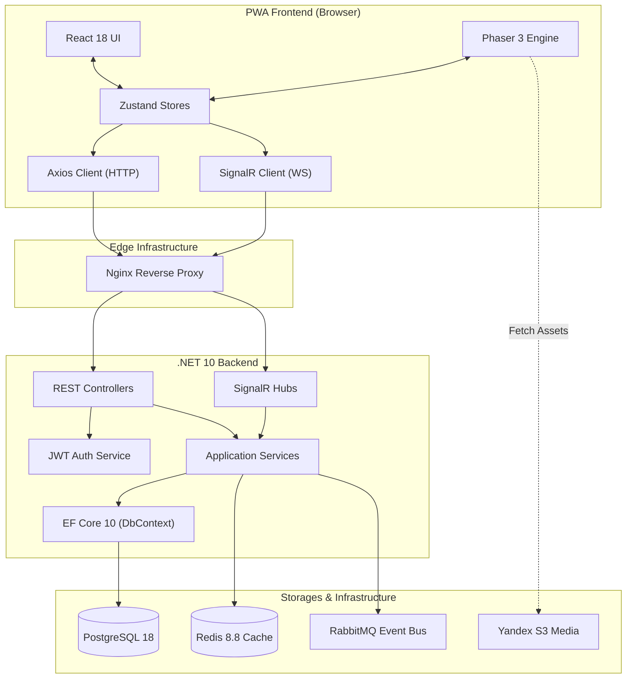

# Инструкция для ИИ-агентов (AGENTS.md)

> Прочитай этот файл в самом начале каждого нового диалога по проекту **Улиткроши**.
> Он содержит детальное архитектурное описание системы, технологический стек, связи компонентов и практические правила разработки.

---

## 1. Краткое описание проекта

**«Улиткроши»** — это детский игровой комплекс и PWA-приложение (Progressive Web Application), сочетающее элементы виртуального питомца, коллекционирования, развивающих мини-игр и социального взаимодействия.

* **Целевая аудитория:** Дети от 4 до 12 лет и их родители (предусмотрен родительский режим).
* **Ключевая особенность:** Асинхронная реалтайм-архитектура на базе **SignalR** и **WebSocket**, обеспечивающая мгновенный отклик интерфейса (оптимистичные обновления) даже при нестабильном мобильном интернет-соединении.
* **Игровые механики:** 
  * Уход за питомцем-улитокрашем (сытость, чистота, счастье, здоровье).
  * 10 стадий эволюции питомца по мере накопления опыта (EXP).
  * 3 развивающие мини-игры: **CatchGame** (Ловилка), **MemoryGame** (Память), **SnakeGame** (Змейка).
  * Система инвентаря, магазинов, фруктовой капчи и голосового ввода имени.

### 1.1. История разработки и репозитории
* **Первоначальные разработчики:** Группа авторов `@zuevus` (Yury Zuev) и `@Renko-hub` (Renko).
* **Исходный GitHub-репозиторий:** `git@github-boss:ulitkroshi/main-source.git` (пользователь `boss@gamingsoft.ru`).
* **Рабочий GitHub-репозиторий:** `git@github.com:JMNext/ulitkroshi.git` (скопирован 30.07.2026 для развития проекта с ИИ-агентом).
* **Таск-трекер разработчиков:** OpenProject (`https://service.biolivestick.com/projects`).
* **Хронология:**
  * **Конец июля 2026:** Разработка первоначальной командой приостановилась. Проведен аудит (`tasks/technical_audit.md`). Выявлено, что бэкенд на VDS не подсоединен к публичному демо.
  * **13.08.2026:** Разработчики вернулись к работе, внесли изменения в `main-source.git` и задеплоили обновленный демо-фронтенд по адресу `https://ulitkroshi.website.twcstorage.ru/`. Проведен повторный аудит (`tasks/technical_audit_2026-08-13.md`).
  * **22.08.2026:** Проведен повторный технический аудит (`tasks/technical_audit_2026-08-22.md`). Изменений в Git-репозитории, сборке S3 и на VDS-сервере со стороны авторов за период с 13.08 по 22.08 не зафиксировано.
  * **26.08.2026:** Проведен технический аудит (`tasks/technical_audit_2026-08-26.md`). Обнаружен новый деплой бандла фронтенда на S3 Timeweb (от 25.08.2026). Изменений в Git-репозитории и бэкенде на VDS не обнаружено.
  * **15.09.2026:** Проведен технический аудит (`tasks/technical_audit_2026-09-15.md`). Зафиксирована серия коммитов разработчика Renko по рефакторингу UI/UX, анимаций и выносу TypeScript бэкенда.
  * **22.09.2026:** Проведен технический аудит (`tasks/technical_audit_2026-09-22.md`). Зафиксировано 5 коммитов (версии 1.0 и 1.1) с разделением бэкенда на микросервисы (`auth-service` :3001 и `game-service` :3002) и добавлением 2 новых мини-игр («Гоночки» и «Самолетики»). Демо-стенд S3 обновлен 21.09.2026 и работает на Mock API.
  * **27.09.2026:** Проведен технический аудит релиза «Версия 1.2» (`tasks/technical_audit_2026-09-27.md`). Бэкенд переведен на монолит Node.js/Express и развернут на `https://ulitkroshi.webtm.ru` (`91.200.150.9`) с БД PostgreSQL. Флаг `isMock = false` активирован. Выявлены критические блокеры: ошибка проксирования Nginx для `/game/*` (`405 Not Allowed`), самоподписанный SSL-сертификат и фиктивная клиентская логика кодов.

---

## 2. Технологический стек

### 2.1. Frontend (Клиентская часть PWA)
| Компонент | Технология / Библиотека | Назначение |
|---|---|---|
| **Язык & Сборка** | TypeScript 5.x, Vite 5.x | Типизация, быстрая сборка и HMR |
| **Интерфейс** | React 18.x | Компонентный UI модальных окон, форм и настроек |
| **Игровой движок** | Phaser 3.x | 2D Canvas анимации питомцев, физика и сцены мини-игр |
| **Управление состоянием** | Zustand 4.x | Реализация независимых сторов (Auth, Main, Care, Games, UI) |
| **HTTP Клиент** | Axios 1.x | REST API клиент с Interceptors (Refresh token queue & Retry) |
| **Реалтайм** | SignalR Client 8.x | WebSocket дуплексное соединение с бэкендом |
| **PWA & Media** | Service Worker, Web Speech API | Офлайн-кэш, голос для ввода имени, медиа-ассеты |

### 2.2. Backend (Серверная часть)
| Компонент | Технология | Назначение |
|---|---|---|
| **Платформа & Язык** | .NET 10, C# 13 | Высокопроизводительный сервер приложений |
| **Web API & Hubs** | ASP.NET Core Web API, SignalR 10 | REST API контроллеры и двунаправленные хабы |
| **Аутентификация** | ASP.NET Core Identity, JWT Bearer | Управление пользователями, сессиями и токенами |
| **ORM & Database** | Entity Framework Core 10, AutoMapper | Репозитории, миграции и картографирование DTO |
| **Валидация & Логи** | FluentValidation 11, Serilog + Seq | Валидация входных моделей и структурированные логи |

### 2.3. Хранилища и Инфраструктура
* **PostgreSQL 18:** Основное реляционное хранилище (источник истины для профилей, питомцев, транзакций).
* **Redis 8.8:** Оперативный кэш, состояние сессий и активных параметров питомцев.
* **RabbitMQ:** Брокер сообщений (Event Bus) для шины событий и фоновой обработки.
* **Yandex Object Storage (S3):** Хранение медиа-ассетов, спрайтов и видео-анимаций.
* **Nginx:** Reverse Proxy, SSL Termination (Let's Encrypt), WebSocket Upgrade.
* **Docker & Docker Compose:** Контейнеризация и оркестрация в dev/prod окружении.
* **Prometheus & Grafana:** Мониторинг метрик производительности.

### 2.4. Хостинг и окружения (Production & Staging)
* **Frontend Hosting (Vercel PWA & Timeweb S3):**
  * Публичный фронтенд первоначально был развернут на Vercel (`https://ulitkroshi.vercel.app/`).
  * С 13.08.2026 активное демо выложено на Timeweb Cloud Object Storage (`https://ulitkroshi.website.twcstorage.ru/`).
  * Клиентская часть построена по принципу **Offline-First PWA**: благодаря движку Phaser 3 и Zustand LocalStorage интерфейс, анимации ухода и 2D-игры работают автономно в браузере.
* **Backend Hosting (Self-Hosted VPS):**
  * Серверная часть (.NET 10 Web API, SignalR, PostgreSQL, Redis) разворачивается на выделенном Linux VPS сервере **`91.200.150.9`** (домен `dev-app.biolivestick.com` / `dev-api.biolivestick.com` / `dev-app.ailingo-orion.com`, SSH-порт `2022`).
  * Развертывание осуществляется через **Ansible** (`infrastructure/ansible/`) и **Docker Compose** (`deployment/`). Nginx на VPS проксирует хосты `dev-app` (`:3000`), `dev-api` (`:5000`) и OpenProject (`:8080`).
* **Маршрутизация API (`/api`):**
  * На фронтенде запросы отправляются относительно пути `/api` (`VITE_API_BASE="/api"`), перенаправляемого на VPS бэкенд через Nginx proxy или Vercel rewrites.

---

## 3. Архитектура системы

### 3.1. Бэкенд (.NET 10 Layered Monolith / Clean Architecture)
Исходный код расположен в `backend/src/` и разделен на логические слои с возможностью постепенного выноса микросервисов:

1. **`UC.Domain`**:
   - Содержит доменные модели (`FruitCode`, `MiniGameStatistics`, `UpdatePetsDto`, `UpdatePlayerProfileDto`), интерфейсы сервисов (`IPetService`, `IMiniGameService`, `IPlayerProfileService`, `IAuthService`) и репозиториев (`IUcGameRepository`).
2. **`UC.Application`**:
   - DTOs (`AuthResponseDto`, `PetDto`, `PlayerProfileDto`, `MiniGameResultDto` и др.).
   - Маппинг конфигурации (`PlayerProfileMappingProfile`).
   - Реализация бизнес-сервисов (`PetService`) и игрового репозитория (`UcGameRepository`).
3. **`UC.Infrastructure`**:
   - Контексты Entity Framework: `UcDbContext` (игровые сущности) и `IdentityAppDbContext` (учетные записи и роли).
   - Сущности БД: `ApplicationUser`, `UserSession`, `PlayerProfile`, `Pet`, `PetStage`, `PetType`, `InventoryItem`, `ItemDefinition`, `MiniGameResult`, `Friend`, `Transaction`, `UsedQrCode`.
   - Перечисления (Enums): `ActivityType`, `ItemCategory`, `MiniGameType`, `PetRarity`, `PetStat`, `TransactionType` и др.
   - Сидеры базы данных (`IdentityDbSeed`).
4. **`UC.Auth`**:
   - JWT настройки (`JwtSettings`), сервисы генерации токенов (`JwtTokenGenerator`), управления сессиями (`UserSessionService`) и авторизации (`AuthService`).
5. **`UC.Presentation`**:
   - Точка входа в приложение (`Program.cs`).
   - REST Контроллеры (`AuthController`, `WeatherForecastController`) и SignalR хабы.

### 3.2. Фронтенд (React + Phaser 3 + Zustand PWA)
Исходный код расположен в `frontend/src/`:

* **`game/scenes/`**:
  * `BootScene.ts` — Загрузка базовых ресурсов и старт.
  * `LoginScene/` — Авторизация и загрузка профиля.
  * `Registration/` — Пошаговый мастер регистрации:
    * `Step_1`: Выбор имени питомца (с поддержкой голосового ввода Web Speech API).
    * `Step_2`: Ввод номера телефона и ПИН-кода.
    * `Step_3`: Фруктовая капча (`CaptchaFruitGrid`).
    * `Step_4`: Финальный экраном успеха и запуск игры.
  * `MainScene/` — Главная сцена ухода за питомцем:
    * Компоненты ухода: `PetCharacter.tsx` (кормление `feedPet`, мытье `washPet`, сон `sleepPet`, игра `playBall`).
    * Модальные окна: `ShopModal`, `PetsModal`, `ProfileEditUI`, `HeaderUI`, `BottomMenu`.
  * Мини-игры:
    * `CatchGame/`: Игра-ловилка падающих предметов (`CatchGameScene`, `CatchGamePhysicsManager`).
    * `MemoryGame/`: Карточки на развитие памяти (`MemoryGameScene`, `MemoryGrid`).
    * `SnakeGame/`: Классическая змейка (`SnakeGameScene`, `SnakeGameLogicManager`).
* **`store/`**:
  * Zustand-сторы: `useAuthStore`, `useMainGameStore`, `usePetCareStore`, `useShopStore`, сторы для шагов регистрации и каждой мини-игры.
* **`api/`**:
  * `client.ts`: Настроенный инстанс Axios с JWT-авторизацией, очередью refresh-токенов при 401 иretry-механизмом при временных 5xx сбоях сети.

---

## 4. Связи и потоки данных



1. **Оптимистичные обновления (Optimistic Updates):** При действиях пользователя (кормление, покупка) Zustand-стор мгновенно обновляет UI/Phaser, параллельно отправляя асинхронный запрос через SignalR/Axios. В случае отмены от сервера применяется компенсирующее событие.
2. **Аутентификация & JWT Refresh:**
   - Каждые REST-запросы содержат `Authorization: Bearer <accessToken>`.
   - При получении ошибки `401 Unauthorized` `client.ts` перехватывает запрос, помещает последующие вызовы в очередь `failedQueue`, отправляет единый запрос `/auth/refresh` по `refreshToken`, и после успешного обновления повторяет всю очередь.
3. **Реалтайм синхронизация:** Состояние жизнедеятельности питомцев и прогресс мини-игр обновляются через WebSocket (SignalR).

---

## 5. AI и голосовая логика

* **Распознавание речи (Web Speech API):** На Шаге 1 регистрации (`Registration/Step_1`) встроен компонент `SpeechMicButton.tsx` и `SpeechInputField.tsx`, позволяющий детям продиктовать имя питомца голосом.
* **Вектор развития ML/AI:** В соответствии с архитектурной дорожной картой (Phase 3+) предусмотрено внедрение рекомендательных ML-моделей для адаптации сложности мини-игр под индивидуальный уровень развития ребенка.

---

## 6. Ключевые директории и файлы

```
.
├── backend/                        # Бэкенд на C# .NET 10
│   └── src/
│       ├── AuthController.cs       # REST API контроллер авторизации
│       ├── UC.Application/         # DTOs, сервисы приложения, маппинг AutoMapper
│       ├── UC.Auth/                # Генерация JWT, управление сессиями пользователей
│       ├── UC.Domain/              # Доменные интерфейсы и модели
│       ├── UC.Infrastructure/      # DbContexts (UcDbContext, IdentityAppDbContext), сущности и миграции
│       ├── UC.Presentation/        # Точка входа Program.cs, контроллеры и хабы
│       └── UC.Tests.API/           # Модульные и интеграционные тесты бэкенда
├── frontend/                       # Фронтенд PWA на React + Phaser 3 + TypeScript
│   └── src/
│       ├── api/                    # Axios client, interceptors, API контракты
│       ├── assets/                 # Картинки, звуки, видео ассеты
│       ├── game/                   # Игровой движок Phaser
│       │   └── scenes/             # Сцены: Boot, Login, Registration, MainScene, Catch, Memory, Snake
│       ├── store/                  # Zustand сторы состояния
│       ├── types/                  # TypeScript типы и интерфейсы
│       └── ui/                     # React UI компоненты и модальные окна
├── deployment/                     # Docker Compose конфигурации (dev, debug)
├── infrastructure/                 # Скрипты развертывания Ansible
└── initial_docs/                   # Первоначальные ТЗ и arch.pdf
```

---

## 7. Правила управления задачами

1. **Сначала планирование**: Запиши план в файл `tasks/todo.md` с отмечаемыми пунктами.
2. **Проверка плана**: Зафиксируй изменения перед началом реализации.
3. **Отслеживание прогресса**: Отмечай выполненные пункты по мере продвижения.
4. **Объяснение изменений**: Краткое описание каждого шага.
5. **Документирование результатов**: Добавь раздел обзора в файл `tasks/todo.md`.
6. **Извлечение уроков**: Обнови файл `tasks/lessons.md` после внесения исправлений.

---

## 8. Практические рекомендации для ИИ-агентов

### 8.1. Принцип «Чистой системы» (WSL Ubuntu 24.04)
* Разработка ведет в WSL Ubuntu 24.04 под ОС Windows 11 Pro + WSL2 (файловая система NTFS).
* **Категорически запрещено** устанавливать новые модули, пакеты или компоненты в глобальное окружение ОС WSL без явного согласования с пользователем.
* В WSL установлены только: `git`, `docker`, `python`, `ansible`, `node`, `npm`.
* Для работы с базами данных PostgreSQL / Redis всегда использовать Docker-контейнеры.

### 8.2. Безопасность внесения изменений
* **Доменный слой (`UC.Domain`):** Изменения интерфейсов требуют обновления их реализаций в `UC.Application` и `UC.Infrastructure`.
* **Entity Framework (`UC.Infrastructure`):** При изменении сущностей (`Pet`, `PlayerProfile` и т.д.) обязательно учитывать разделение контекстов `UcDbContext` и `IdentityAppDbContext`.
* **Phaser + React связь:** Состояние передается через Zustand. Не создавайте прямых вызовов DOM из Phaser-сцен — используйте подписчики и методы Zustand сторов.

### 8.3. Основные команды для разработки и проверки

```bash
# === ФРОНТЕНД (frontend/) ===
npm run dev           # Запуск dev-сервера Vite (localhost:5173)
npm run build         # Проверка сборки TypeScript и Vite
npm run lint          # Проверка ESLint

# === БЭКЕНД (backend/src/UC.Presentation/) ===
dotnet run            # Запуск API сервера .NET 10
dotnet build          # Проверка компиляции решения C#
dotnet test           # Запуск тестов

# === ИНФРАСТРУКТУРА (deployment/) ===
docker compose -f deployment/docker-compose.dev.yml up -d   # Запуск окружения (Postgres, Redis, RabbitMQ)
```

---

### 8.4. Доступы
* Данные доступов и локальные секреты хранятся в git-ignored файле `AGENTS.local.md`.

---

### 8.5. Техническое задание

Прочитай ТЗ в `initial_docs/technical_specification.md`

---
