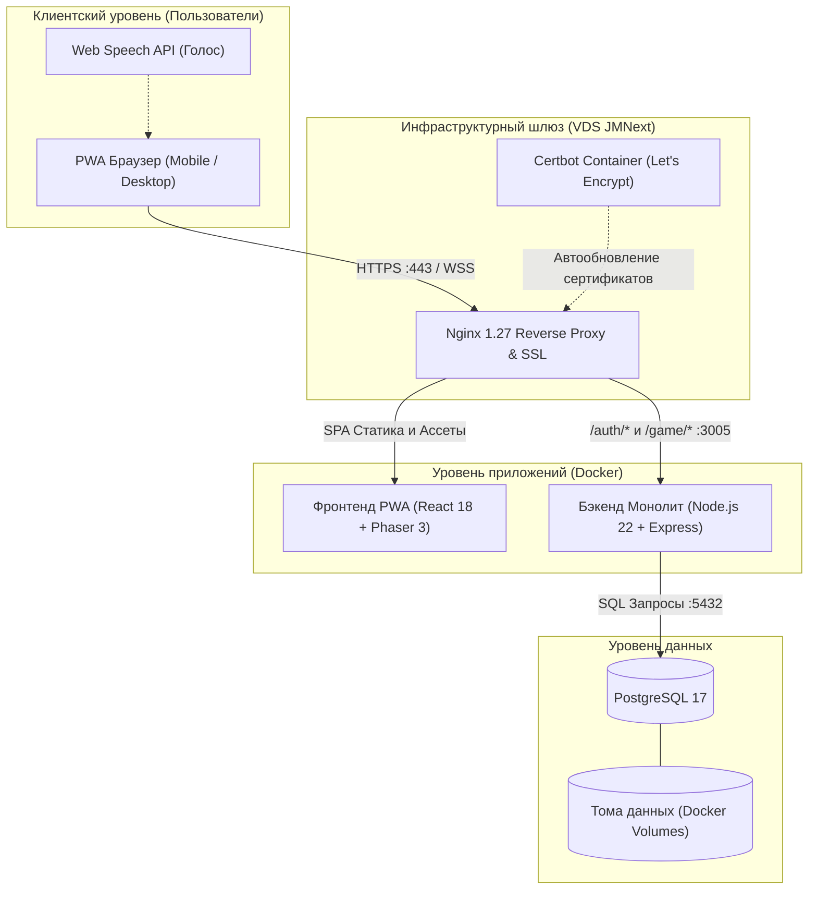
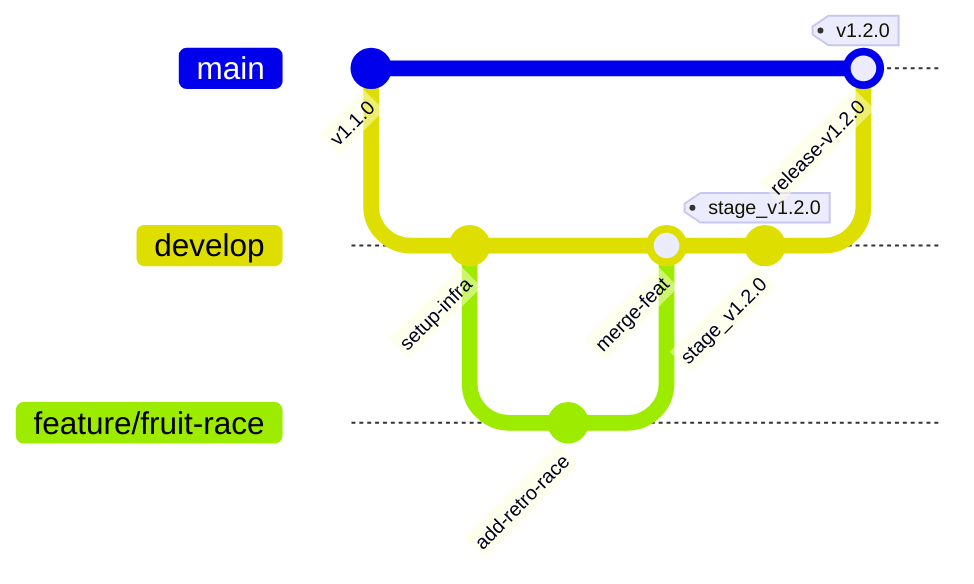

# 🐌 Улиткроши — Детский развивающий игровой комплекс (PWA)

[](https://ulitkroshi.intelcosystem.com)
[](https://github.com/JMNext/ulitkroshi/actions)
[](https://ulitkroshi.intelcosystem.com)
[](https://ulitkroshi.intelcosystem.com)
[](https://ulitkroshi.intelcosystem.com)
[](https://ulitkroshi.intelcosystem.com)

**«Улиткроши»** — это прогрессивное веб-приложение (PWA) и интерактивный развивающий комплекс для детей от 4 до 12 лет. Проект сочетает механику заботы о виртуальном питомце (тамагочи), развитие моторики и когнитивных навыков через 4 аркадные мини-игры, эволюцию персонажей, систему инвентаря и безопасную двухфакторную авторизацию с графическим фруктовым паролем.

* **Develop / Staging сервер (разработка и демонстрация Заказчику):** [https://ulitkroshi.intelcosystem.com](https://ulitkroshi.intelcosystem.com)
* **Боевой сервер (Production):** Будет развернут позже на официальном домене `ulitkroshi.ru`.
* **Сервер стенда:** VDS JMNext (`135.106.228.10`, Debian 13 trixie).

---

## 🏛 1. Архитектура системы

Комплекс построен по сервисной контейнеризированной архитектуре с разделением слоев представления, бизнес-логики и персистентного хранения.



### 1.1. Технологический стек
* **Frontend (PWA):** React 18, Phaser 3 (2D Canvas движок с анимациями ухода и сценами мини-игр), TypeScript 5, Vite 5, Zustand 4 (независимые сторы состояний), Axios (интерцепторы с автоматической очередью обновления JWT).
* **Backend:** Node.js 22 Alpine, TypeScript (рантайм `tsx`), Express.js 4.x. Модульная архитектура: `auth-service` (двухфакторная SMS-авторизация, фруктовый PIN-код, сессии, JWT), `game-service` (питомцы, инвентарь, эволюция, серверная античит-валидация наград за игры).
* **База данных:** PostgreSQL 17 (таблицы `users`, `token_blacklist` с индексами и триггерами).
* **Сетевой шлюз:** Nginx 1.27 (HTTP/2, SSL Termination, сжатие Gzip, SPA fallback, кэширование медиа-ассетов Phaser до 6 месяцев).

---

## 🔄 2. Непрерывная интеграция и доставка (CI/CD)

В репозитории реализован полностью автоматический пайплайн доставки кода на VDS через **GitHub Actions** (`.github/workflows/deploy.yml`).

### 2.1. Почему выбран Self-Hosted Runner
Развертывание осуществляется на собственном раннере (`jmnext-vds-runner`), установленном непосредственно на VDS сервере под изолированным systemd-сервисом пользователя `actions-runner`:

1. **Безопасность закрытого контура:** Нет необходимости открывать во внешний интернет порты SSH (22) или сокеты Docker daemon для облачных раннеров GitHub. Вся работа с контейнерами идет по локальному unix-сокету `/var/run/docker.sock`.
2. **Мгновенный деплой:** Сборка и перезапуск происходят локально. Не тратится время на сетевую передачу многомегабайтных Docker-слоев между облаком GitHub и сервером.
3. **Экономия бюджета:** Отсутствует лимит бесплатных минут GitHub Actions.
4. **Отказоустойчивость:** Раннер зарегистрирован как системный демон Linux (`systemd`), автоматически стартует при загрузке системы и перезапускается при сбоях.

### 2.2. Триггеры запуска пайплайна
* **Push в ветку `develop`:** Основной рабочий триггер. При каждом слиянии или пуше в ветку `develop` запускается полный цикл сборки фронтенда, сборка Docker-образов, деплой на staging-стенд и верификация доступности `/health`.
* **Push тегов `v*.*.*`:** Создание релизного тега автоматически запускает публикацию релизной версии.
* **Ручной запуск (`workflow_dispatch`):** Пайплайн можно запустить вручную через интерфейс GitHub Actions с опциональным параметром `skip_build: true`, что позволяет мгновенно перезапустить контейнеры инфраструктуры без повторной компиляции фронтенда.

---

## ⚙️ 3. Инфраструктура, Ansible и Особенности ОС

Подготовка сервера автоматизирована с помощью набора Ansible-плейбуков в каталоге `infrastructure/ansible/`.

### 3.1. Запуск Ansible на файловой системе NTFS (WSL) — ВАЖНО!
При разработке из-под Windows 11 через подсистему WSL2 проект расположен на примонтированном диске NTFS (`/mnt/d/...`).
> [!WARNING]
> В файловой системе NTFS все файлы и директории в Linux монтируются с маской прав `777` (world-writable). Из соображений безопасности Ansible **по умолчанию игнорирует** локальный файл `ansible.cfg`, если каталог доступен на запись всем пользователям!

Чтобы конфигурационный файл и параметры ролей применялись гарантированно, команду запуска Ansible необходимо предварять переменной окружения `ANSIBLE_CONFIG`:

```bash
ANSIBLE_CONFIG=./ansible.cfg ansible-playbook   -i infrastructure/ansible/inventories/development/hosts   infrastructure/ansible/playbooks/setup-server.yml
```

### 3.2. Особенности операционной системы Debian 13 (trixie) на VDS
Сервер JMNext функционирует под управлением дистрибутива **Debian 13 (trixie)**. При развертывании были учтены следующие системные нюансы:
1. **Репозиторий Docker Engine:** На момент релиза дистрибутив `trixie` является веткой testing, и официальный репозиторий Docker еще не имеет отдельного каталога под это имя. В плейбуке Ansible для стабильной установки Docker CE используется кодовое имя `bookworm`.
2. **Зависимости GitHub Actions Runner:** Официальный клиент раннера GitHub собран на базе .NET Core. В Debian 13 отсутствует устаревшая библиотека `libicu72`, из-за чего стандартный установочный скрипт падает с ошибкой глобализации. В Ansible-роль `github-runner` добавлена обязательная предварительная установка пакета `libicu-dev`.

---

## 🔒 4. Автоматизация SSL (Let's Encrypt & Certbot)

Для домена стенда `https://ulitkroshi.intelcosystem.com` настроен автоматический выпуск и продление бесплатных SSL/TLS-сертификатов Let's Encrypt.

### 4.1. Решение проблемы «курицы и яйца» при первом запуске
Классическая проблема развертывания Nginx с SSL в Docker:
* Конфигурация Nginx содержит директиву `listen 443 ssl;` с ссылкой на файлы сертификата.
* Если сертификат еще не выпущен, Nginx завершает работу с фатальной ошибкой `cannot load certificate`.
* Если Nginx не запущен, порт 80 закрыт.
* Certbot в стандартном режиме `--webroot` не может пройти верификацию домена Let's Encrypt (`Connection refused`).

### 4.2. Архитектурное решение в CI/CD:
1. **Шаг верификации:** Пайплайн перед запуском стека Compose проверяет наличие валидного сертификата Let's Encrypt утилитой `openssl x509 -issuer`.
2. **Первичный Standalone выпуск:** Если сертификат отсутствует или является самоподписанной заглушкой, запускается временный контейнер:
   ```bash
   docker run --rm -p 80:80      -v ulitkroshi-certbot-etc:/etc/letsencrypt      -v ulitkroshi-certbot-var:/var/www/certbot      certbot/certbot certonly --standalone      -d ulitkroshi.intelcosystem.com --agree-tos --email admin@intelcosystem.com --non-interactive
   ```
   Certbot на несколько секунд занимает свободный порт 80, получает настоящий доверенный сертификат и сохраняет его в общий том `ulitkroshi-certbot-etc`.
3. **Старт Nginx:** Запускается основной стек `docker compose up -d`. Nginx сразу видит настоящий сертификат и безошибочно стартует с HTTPS.
4. **Фоновое автопродление:** Сервис `certbot` в `docker-compose.yml` запускается в фоновом режиме, раз в 12 часов проверяет срок действия сертификатов через вебрут `/var/www/certbot` и обновляет их без простоя сервиса.

---

## 🎮 5. Игровой функционал и Экономика

### 5.1. Уход за питомцем на Главном экране
* **Кормление (Drag-and-Drop):** Перетаскивание полезных фруктов и овощей (яблоко, морковь, салат) на улитку восстанавливает очки здоровья (HP).
* **Чистота и Душ:** Интерактивная мочалка и душ отмывают питомца от грязи. Высокий уровень чистоты накладывает активный бафф, увеличивающий начисление монет в играх.
* **Сон и Отдых:** Механика укладывания питомца спать с плавной регенерацией показателей.
* **Голосовой ввод (Web Speech API):** При первичной регистрации ребенок может продиктовать имя питомца голосом через микрофон устройства.

### 5.2. Стек из 4 мини-игр
1. **«Сбор урожая» (Catch Game):** Ловля падающих яблок и листьев с отсеиванием камней на реакцию.
2. **«Змейка» (Snake Game):** Классическая аркадная механика сбора бонусов с растущим хвостом.
3. **«Мемори» (Memory Game):** Тренировка памяти через поиск парных карточек персонажей вселенной «Улиткроши».
4. **«Фруктовые гонки» (Retro Race):** Ретро-гонки с уклонением от препятствий на высоких скоростях.

### 5.3. Экономика и Античит-защита
* **Игровая валюта «Печенье» (`coins`):** Начисляется за успехи в мини-играх и тратится в магазине на покупку еды и кастомизации.
* **Защита от читерства на бэкенде:** Все начисления проверяются в `GameService` по полю `last_minigame_at` в базе данных. Повторные запросы наград чаще одного раза в 5 секунд блокируются кодом `429 Too Many Requests`.
* **Эволюция персонажей:** Накопление 100% опыта (EXP) эволюционирует питомца: растет панцирь, меняется окрас и увеличивается звездность (от 1 до 5 звезд).

---

## 💻 6. Руководство по локальному запуску

### Предварительные требования
* Node.js 22 LTS и npm 10+
* Docker Desktop или Docker Engine с поддержкой Docker Compose v2

### Шаги запуска

1. **Клонирование репозитория:**
   ```bash
   git clone git@github.com:JMNext/ulitkroshi.git
   cd ulitkroshi
   git checkout develop
   ```

2. **Запуск локального окружения в Docker:**
   ```bash
   # Создание локального файла переменных
   cp deployment/.env.example deployment/.env
   
   # Запуск PostgreSQL и Nginx локально
   docker compose -f deployment/docker-compose.yml up -d postgres
   ```

3. **Запуск бэкенда (Node.js Express):**
   ```bash
   npm run dev:backend
   # Бэкенд доступен по адресу: http://localhost:3005
   ```

4. **Запуск фронтенда (React + Vite + Phaser):**
   ```bash
   npm ci
   npm run dev
   # Приложение доступно по адресу: http://localhost:5173
   ```

---

## 📁 7. Структура проекта

```
ulitkroshi/
├── .github/workflows/deploy.yml   # Пайплайн автоматического деплоя на Staging стенд
├── backend/                       # Исходный код монолитного бэкенда
│   ├── auth-service/              # SMS авторизация, JWT, фруктовый пин-код
│   ├── game-service/              # Логика питомцев, мини-игр и наград
│   ├── shared/                    # Подключение к БД (pg Pool), middleware
│   └── server.ts                  # Точка входа сервера Express (:3005)
├── frontend/                      # Исходный код PWA-приложения
│   ├── src/game/scenes/           # Сцены Phaser (Boot, Login, Main, Мини-игры)
│   ├── src/store/                 # Сторы состояния Zustand
│   └── src/api/                   # Axios клиент с интерцепторами
├── deployment/                    # Конфигурации деплоя и контейнеризации
│   ├── docker-compose.yml         # Оркестрация postgres, backend, nginx, certbot
│   ├── backend.Dockerfile         # Docker-образ для бэкенда Node.js 22
│   ├── nginx/nginx.conf           # Конфигурация веб-сервера и проксирования
│   └── postgres/init.sql          # Скрипт инициализации таблиц БД
├── infrastructure/ansible/        # Плейбуки настройки сервера VDS (Debian 13)
├── tasks/                         # Технические отчеты, todo.md и lessons.md
├── AGENTS.md                      # Инструкция для ИИ-агентов (до 300 строк)
└── AGENTS.local.md                # Секреты и доступы (не коммитится в Git)
```

---

## 🛠 8. Регламент разработки и Git Flow (Best Practices)

В проекте принят регламент ветвления, коммитов и версионирования, обеспечивающий высокое качество кодовой базы, воспроизводимость сборок и готовность к масштабированию команды.



### 8.1. Структура веток
* **Постоянные ветки:**
  * `main` — стабильная продуктивная версия (**Production**). Сборки в продакшен выполняются **только** из этой ветки (домен `ulitkroshi.ru`).
  * `develop` — основная интеграционная ветка разработки и **Staging** стенда (`ulitkroshi.intelcosystem.com`).
* **Временные рабочие ветки** (создаются от `develop`):
  * `feature/<название>` — новая функциональность (например, `feature/voice-recognition`, `feature/fruit-race`).
  * `fix/<название>` — исправление багов в процессе разработки (например, `fix/cookie-deduction-bug`).
  * `hotfix/<название>` — срочные исправления критических багов в production (создаются от `main`, вливаются в `main` и `develop`).
  * `chore/<название>` — технические задачи (обновление зависимостей, CI/CD, Docker, Ansible).
  * `docs/<название>` — изменения документации и схем (`AGENTS.md`, `README.md`, `CHANGELOG.md`).

### 8.2. Правила оформления коммитов (Commit Convention)
Сообщения коммитов формируются по стандарту [Conventional Commits](https://www.conventionalcommits.org/ru/v1.0.0/) с зарезервированным префиксом для трекера задач (Redmine):

* **Текущий формат (до подключения трекера):**
  ```text
  <тип>(<область>): <краткое описание на русском>
  
  # Примеры:
  feat(game): добавление 4-й мини-игры Фруктовые гонки
  fix(ssl): принудительный выпуск Let's Encrypt вместо самоподписанного сертификата
  chore(docker): оптимизация Dockerfile бэкенда для Node.js 22 Alpine
  docs(readme): актуализация регламента разработки и версионирования
  ```
* **Формат при подключении Redmine / трекера задач:**
  ```text
  [TICKET-ID] <тип>(<область>): <краткое описание>
  
  # Примеры:
  [ULIT-105] feat(auth): верификация номера телефона через SMS-шлюз
  [ULIT-142] fix(shop): исправление ошибки списания печенья при спам-кликах
  ```

### 8.3. Версионирование и Релизы
Проект строго следует спецификации [SemVer 2.0.0](https://semver.org/lang/ru/) с добавлением метаданных сборки: `vMAJOR.MINOR.PATCH-b<BUILD_NUMBER>`:
* `MAJOR` — архитектурные смены и несовместимые изменения API.
* `MINOR` — добавление новой игровой механики, мини-игр или функциональных модулей.
* `PATCH` — исправления багов и мелкие доработки.
* `-b<BUILD>` — сквозной номер сборки, автоматически инкрементируемый при каждом запуске CI/CD в GitHub Actions (`GITHUB_RUN_NUMBER`), например `v1.2.1-b45` (или `v1.2.1-dev` при локальной сборке). Это позволяет сразу видеть на экране, что обновление применилось.

**Схема тегирования для сред:**
* `develop` (коммит) — автоматический деплой на Develop/Staging стенд (`ulitkroshi.intelcosystem.com`).
* `stage_vX.Y.Z` — кандидат в релиз (тег для фиксации стабильной демо-версии Заказчику).
* `vX.Y.Z` — релизный тег в ветке `main` (автодеплой в Production на `ulitkroshi.ru`).

### 8.4. Ведение журнала изменений (CHANGELOG.md)
* Любые значимые изменения, фиксы и новые фичи обязаны отражаться в файле [`CHANGELOG.md`](./CHANGELOG.md) по стандарту [Keep a Changelog](https://keepachangelog.com/ru/1.0.0/).
* Текущие изменения вносятся в блок `[Unreleased]`, а в момент формирования релиза превращаются в секцию `[X.Y.Z] — YYYY-MM-DD`.

### 8.5. Дисциплина слияний (Pull Requests)
* **Для соло-разработчика:** Все доработки ведутся в отдельных ветках (`feature/*`, `fix/*`). Слияние в `develop` рекомендуется выполнять через GitHub Pull Request (с опцией *Squash and merge* или *Rebase and merge*) для чистоты истории Git. Прямые пуши в `main` **категорически запрещены**.
* **При командной разработке:** На ветки `main` и `develop` включаются Branch Protection Rules, требующие прохождения CI-тестов и аппрува минимум одного ревьювера.

---

## 👥 9. Авторы и Развитие проекта
* **Оригинальная команда авторов:** `@zuevus` (Yury Zuev), `@Renko-hub` (Renko).
* **Развитие и развертывание:** Команда **JMNext** & IntelCoSystem.
