# Документация по настройки и установки серверов окружения

## Схема редиректа nginx

```text
мой-домен.com:80   ──► 301 → https://www.мой-домен.com
мой-домен.com:443  ──► 301 → https://www.мой-домен.com

www.мой-домен.com:80  ──► 301 → https://www.мой-домен.com
www.мой-домен.com:443 ──► :8098

dev-app.мой-домен.com:80  ──► 301 → https://dev-app.мой-домен.com
dev-app.мой-домен.com:443 ──► :8088
```

## Для запуска Ansible конфигурации используется WSL

1. Устанавливаем Python Ansible (из wsl)
```bash
sudo apt install python3-pip
pip3 install ansible
echo 'export PATH=$HOME/.local/bin:$PATH' >> ~/.bashrc
source ~/.bashrc
ansible --version
```

2. Проверка статуса
```bash
ansible-playbook -i inventory.yml setup-server.yml -v --limit development --tags "status"
```

3. Переходим в папку с проектом инфраструктуры и устанавливаем необходимые переменные
```bash
cd /mnt/d/.../source/infrastructure/Ansible
export DEV_APP_PASSWORD="2uKph9UlP2hu"
```

4. Запускаем развёртывание для среды (в примере develop)
```bash
ansible-playbook -i inventory.yml setup-server.yml -v --limit development
```

> [!WARNING]
> Игнорируем ошибку с Debian.yml - это не критично

## Архитектура и подход к конфигурации

### Обзор решения

Разработана полностью автоматизированная система развертывания сервера для проекта Улиткроши с использованием **Ansible** и **Docker**. Решение обеспечивает идемпотентную, безопасную и масштабируемую конфигурацию как для development, так и для production окружений.

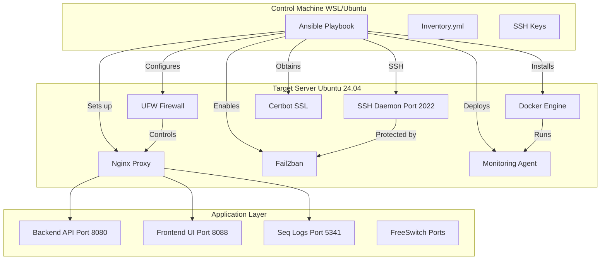

### 1. Структура директорий

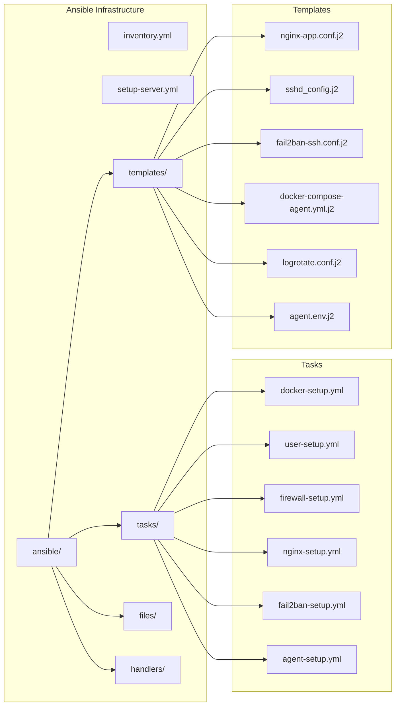

### 2. Процесс развертывания

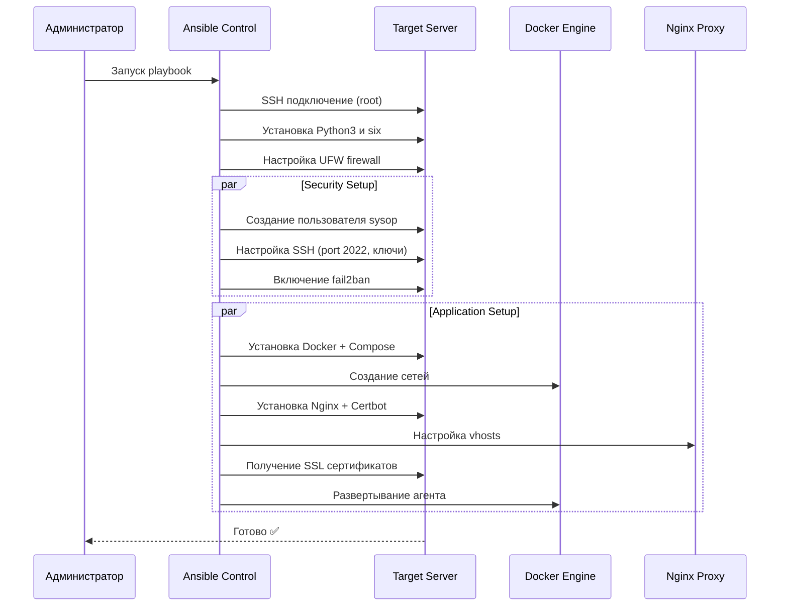

### 3. Компоненты безопасности

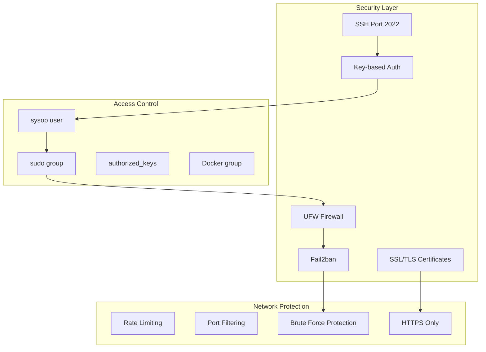

### 4. Инвентаризация и окружения

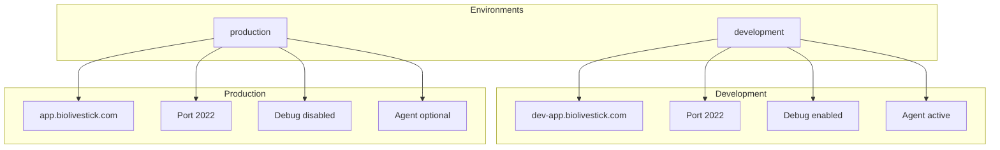

### 5. Мульти-доменная Nginx конфигурация

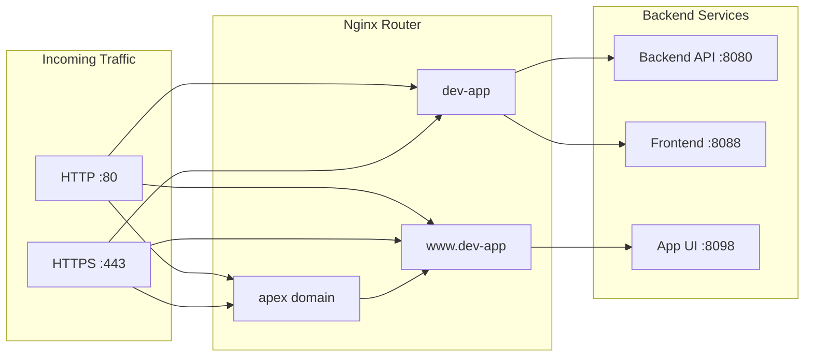

### 6. Docker сеть и контейнеры

```mermaid
graph TB
    subgraph "Docker Networks"
        A[cure-services-network]
        B[monitoring-network]
    end
    
    subgraph "Containers"
        C[orion-app-dev Agent]
        D[Future Backend]
        E[Future Frontend]
    end
    
    subgraph "Volumes"
        F[/var/log/orion-agent]
        G[/opt/orion-agent/data]
        H[/var/run/docker.sock]
    end
    
    C --> A
    C --> B
    D --> A
    E --> A
    
    C -.-> F
    C -.-> G
    C -.-> H
```

### 7. Пошаговый workflow

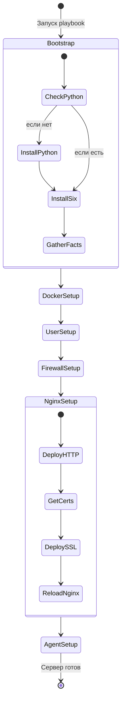
### 8. Логика получения SSL

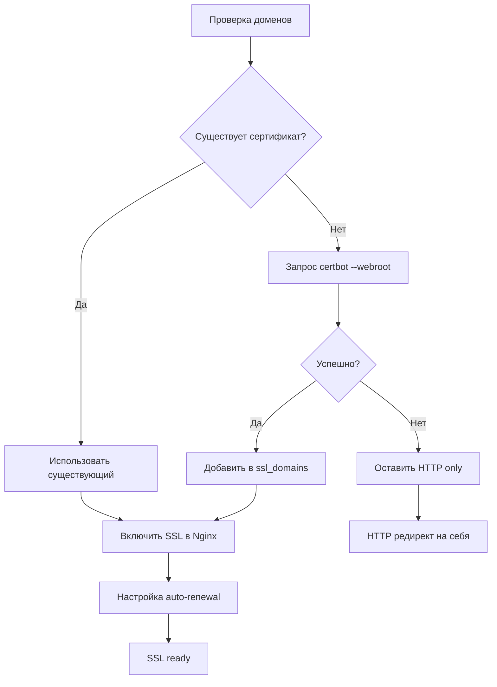

### 9. Система мониторинга

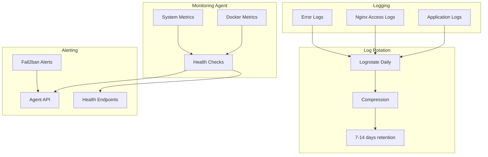
### 10. Многоуровневая защита

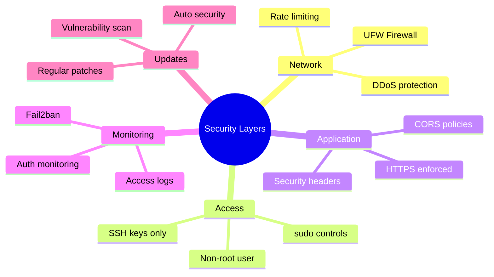
### 11. Переменные окружения

```yaml
# Обязательные переменные
DEV_SERVER_IP: "IP сервера разработки"
PROD_SERVER_IP: "IP production сервера"
ROOT_PASSWORD: "Временный пароль root"

# Опциональные
AGENT_API_KEY: "Ключ для мониторинга"
AGENT_IMAGE: "Образ агента"
```

### 12. Структура vhosts

```yaml
vhosts:
  - name: "www"
    domain: "www.biolivestick.com"
    backend_port: 8098
    health_check: true
    has_api: true
    
  - name: "dev"
    domain: "dev-app.biolivestick.com"
    backend_port: 8088
    health_check: true
    has_api: false
```

### 13. Итоговое состояние

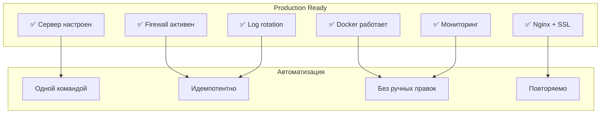

# Версионирование
**Версия документации/продукта:** 1.0  
**Последнее обновление:** 2026-06-08
**Поддержка:** developers@biolivestick.com