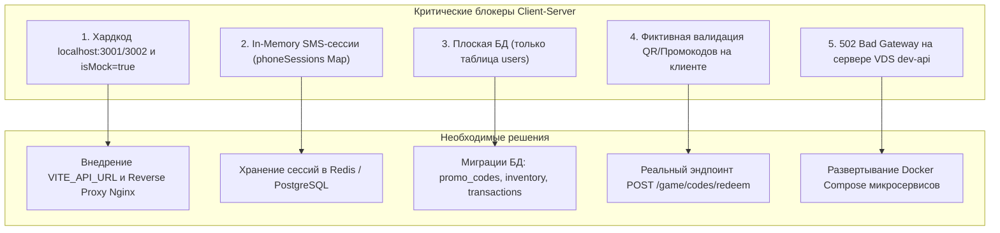

# Отчет по техническому аудиту проекта «Улиткроши» (15.09.2026 — 22.09.2026)

> **Дата аудита:** 22 сентября 2026 г.  
> **Анализируемый период:** 15.09.2026 — 22.09.2026  
> **Оригинальный репозиторий:** `git@github-boss:ulitkroshi/main-source.git` (ветка `main`)  
> **Демо-стенд S3:** `https://ulitkroshi.website.twcstorage.ru/`  
> **Сервер бэкенда:** `dev-api.biolivestick.com` (`91.200.150.9`)

---

## 1. Сводка и ключевые выводы

1. **Активность разработчиков:** За отчетный период разработчик **Renko** зафиксировал **5 коммитов** (версии 1.0 и 1.1), внеся масштабные изменения: **+10,700 строк / -9,100 строк** в 130+ файлах.
2. **Переход на микросервисную архитектуру бэкенда (Node.js/Express):**
   * Бэкенд разделен на два независимых сервиса: **`auth-service`** (порт `3001`) и **`game-service`** (порт `3002`) с общей библиотекой **`backend/shared/`** (`db.ts`, `auth.middleware.ts`, `types.ts`, `utils.ts`).
3. **Расширение игрового функционала:**
   * Добавлены 2 новые мини-игры: **«Фруктовые гоночки»** (`RacingGameScene`) и **«Самолетики / Фруктовый бой»** (`PlanesGameScene`).
   * Доработана физика взаимодействия, баллистика кормления и перетаскивания предметов (`startFeedingDrag`, `startWashingDrag`).
   * Рефакторинг сторов Zustand на модульные срезы (slices: `inventory`, `cart`, `checkout`, `login`, `register`, `pet`, `wallet`).
4. **Статус демо-стенда (S3 Timeweb):**
   * Бандл обновлен **21.09.2026 22:25 GMT** (в ночь на 22.09.2026).
   * **Демо-версия на 100% работает в режиме Mock API (`isMock = true`)**. Все запросы к реальному бэкенду отсекаются компилятором при сборке, состояние сохраняется исключительно в `localStorage` браузера.
5. **Готовность к переходу на клиент-серверную архитектуру:**
   * **Оценка готовности: ~40%**. Бэкенд содержит базовые эндпоинты авторизации и изменения баланса монет, однако переход блокируется рядом критических архитектурных ограничений.

---

## 2. Хронология коммитов в оригинальном репозитории (15.09 — 22.09.2026)

| Хэш коммита | Дата и время | Автор | Сообщение | Ключевые изменения |
|---|---|---|---|---|
| [`13c9116`](file:///home/main/Yuri/Work/Projects/%D0%A3%D0%BB%D0%B8%D1%82%D0%BA%D1%80%D0%BE%D1%88%D0%B8/src/ulitkroshi) | 17.09.2026 18:31 | Renko | Улиткроши. Версия 1.0 | Рефакторинг шагов регистрации Step 1–4, добавление компонентов `ScannerScene`, разделение констант магазина |
| [`b8c52ba`](file:///home/main/Yuri/Work/Projects/%D0%A3%D0%BB%D0%B8%D1%82%D0%BA%D1%80%D0%BE%D1%88%D0%B8/src/ulitkroshi) | 17.09.2026 19:40 | Renko | Улиткроши. Версия 1.0 | Введение архитектуры Zustand Slices (`cart.slice`, `checkout.slice`, `login.slice`, `register.slice`, `pet.slice`, `wallet.slice`), EventBus |
| [`945ad8e`](file:///home/main/Yuri/Work/Projects/%D0%A3%D0%BB%D0%B8%D1%82%D0%BA%D1%80%D0%BE%D1%88%D0%B8/src/ulitkroshi) | 19.09.2026 04:47 | Renko | Улиткроши. Версия 1.0 | Вынос валидаций `zod` в `auth.schema.ts`, сервисный слой `services/auth.service.ts` и `services/game.service.ts`, модалки конфликтов магазина |
| [`54c8771`](file:///home/main/Yuri/Work/Projects/%D0%A3%D0%BB%D0%B8%D1%82%D0%BA%D1%80%D0%BE%D1%88%D0%B8/src/ulitkroshi) | 19.09.2026 12:51 | Renko | Улиткроши. Версия 1.1 | **Разделение бэкенда на микросервисы:** `auth-service` (:3001) и `game-service` (:3002). Добавление сцен мини-игр `PlanesGameScene` и `RacingGameScene`. Выделение `auth.api.ts` и `game.api.ts` на клиенте |
| [`76d6f72`](file:///home/main/Yuri/Work/Projects/%D0%A3%D0%BB%D0%B8%D1%82%D0%BA%D1%80%D0%BE%D1%88%D0%B8/src/ulitkroshi) | 20.09.2026 04:38 | Renko | Улиткроши. Версия 1.1 | Доработка физики и фабрик `PlanesHelicopterFactory`, `PlanesCollisionManager`, `RacingGridRenderer`, баланс кормления в `FoodPanel` |

---

## 3. Детальный аудит демо-стенда (`https://ulitkroshi.website.twcstorage.ru/`)

* **Дата и время обновления бандла на S3:** `Mon, 21 Sep 2026 22:25:08 GMT` (ETag: `"c85a6053459e52c6b73b6b96f674a458"`).
* **Анализ скомпилированного бандла (`/assets/index-B3TjGXVZ.js`):**
  1. В исходном файле `frontend/src/api/client.ts` объявлена константа:
     ```typescript
     export const isMock = true;
     ```
  2. При сборке через Rollup/Vite условия `if (isMock) return mockApi.method()` приводят к полному вырезанию ветки реальных сетевых запросов (Dead Code Elimination). В бандл включен исключительно объект `mockApi`, сохраняющий пользователей, баланс и питомцев в `localStorage`.
  3. Базовые URL в коде клиентов захардкожены на локальные порты машины разработчика:
     ```typescript
     export const authApiInstance = axios.create({ baseURL: "http://localhost:3001" });
     export const gameApiInstance = axios.create({ baseURL: "http://localhost:3002" });
     ```
     При простом переключении `isMock = false` в продакшн-окружении браузер пользователя попытается слать сетевые запросы на собственный `localhost`, что приведет к немедленным сетевым ошибкам `ERR_CONNECTION_REFUSED`.

---

## 4. Оценка готовности к клиент-серверной архитектуре

### 4.1. Что уже реализовано на стороне клиента и сервера

| Компонент / Механика | Реализация на клиенте (Frontend) | Реализация на бэкенде (Node.js/Express) |
|---|---|---|
| **Авторизация по телефону** | Ввод телефона, проверка существования, маска ввода | `POST /auth/login/phone-check`, `POST /auth/login/phone` |
| **SMS-верификация** | Модальное окно ввода SMS-кода, таймер повтора | `POST /auth/login/verify-sms` (генерация 4-значного кода через SMS.ru / тестовый режим) |
| **Фруктовая капча** | Сетка фруктов (4 символа), виброотклик/анимация тряски | `POST /auth/login/fruit`, `POST /auth/register/fruit` с валидацией через `Zod` |
| **JWT Сессии** | Axios-интерцепторы на `401 Unauthorized` с авто-refresh токена | Генерация `accessToken` (15 мин) и `refreshToken` (7 дней), блэклист токенов в PostgreSQL |
| **Профиль игрока** | `syncUserStores` синхронизирует Zustand со структурой `UserProfile` | `GET /auth/me` возвращает профиль, баланс монет и статус питомца |
| **Игровая экономика** | Покупка предметов, начисление наград за мини-игры | `POST /game/pharmacy/action`, `GET /game/pharmacy/coins` с серверным расчетом баланса |
| **Уход и здоровье (HP)** | Анимации мытья, сна, кормления и игры | `POST /game/pharmacy/feed` (+20 HP), расчет урона (-25 HP) |

---

### 4.2. Критические блокеры и технические долги перед переходом на Client-Server



1. **🔴 Блокер №1: Конфигурация API URL и CORS:**
   * Отсутствует поддержка переменных окружения Vite (`import.meta.env.VITE_API_AUTH_URL`, `import.meta.env.VITE_API_GAME_URL` или единого прокси `/api`).
   * Разделение на два разных порта (`:3001` и `:3002`) требует сложной настройки CORS в вебе, либо единого обратного прокси (Nginx/Traefik).
2. **🔴 Блокер №2: In-Memory состояние сессий (`phoneSessions = new Map()`):**
   * Сессии верификации SMS хранятся в оперативной памяти Node.js-процесса `auth-service`.
   * При перезапуске контейнера, сбое или горизонтальном масштабировании (PM2/Docker) пользователи теряют текущую сессию входа. Необходим перенос сессий в Redis или временную таблицу БД.
3. **🔴 Блокер №3: Отсутствие таблиц инвентаря и предметов в БД:**
   * В базе данных PostgreSQL по-прежнему создается **только одна таблица `users`**:
     ```sql
     CREATE TABLE public.users (
       id SERIAL PRIMARY KEY,
       name VARCHAR(50) UNIQUE,
       phone VARCHAR(20) UNIQUE,
       password VARCHAR(100),
       roles TEXT[],
       coins INT DEFAULT 0,
       unlocked_pets INT[],
       pet_name VARCHAR(50),
       pet_health INT DEFAULT 100,
       last_minigame_at TIMESTAMP,
       created_at TIMESTAMP,
       updated_at TIMESTAMP
     );
     ```
   * На бэкенде отсутствуют таблицы:
     * `inventory` / `user_items` (купленная еда, мыло, мячи, лекарства);
     * `promo_codes` / `qr_codes` (база кодов с упаковок, срок действия, статус `is_used`, `used_by_user_id`);
     * `transactions` (история покупок и начислений валюты);
     * `minigame_records` (таблица рекордов).
4. **🔴 Блокер №4: Фиктивный QR/Промокод сканер на клиенте:**
   * На фронтенде сканирование кодов по-прежнему работает через локальный остаток от деления:
     ```typescript
     addPetByCode: (code) => {
       const parsed = parseInt(code.replace(/\D/g, ""), 10);
       usePetStore.getState().unlockPet(!isNaN(parsed) ? parsed % 20 : (code.length % 19) + 1);
       return true;
     };
     ```
   * На сервере нет эндпоинта для проверки и погашения кодов продукции.
5. **🔴 Блокер №5: Недоступность бэкенда на сервере VDS:**
   * Запрос к `https://dev-api.biolivestick.com/` возвращает `502 Bad Gateway`. Серверная часть не запущена в Docker Compose на VPS.

---

## 5. Рекомендованный план перехода на полноценный Client-Server

### Этап 1. Конфигурация API на Frontend (1 рабочий день)
1. Заменить жесткий `isMock = true` на чтение флага из `.env`:
   ```typescript
   export const isMock = import.meta.env.VITE_USE_MOCK === "true";
   ```
2. Настроить относительные пути или переменные окружения для инстансов Axios:
   ```typescript
   export const authApiInstance = axios.create({ baseURL: import.meta.env.VITE_AUTH_API_URL || "/api/auth" });
   export const gameApiInstance = axios.create({ baseURL: import.meta.env.VITE_GAME_API_URL || "/api/game" });
   ```

### Этап 2. Расширение схемы БД и доменной логики бэкенда (2-3 рабочих дня)
1. Создать миграции таблиц `promo_codes`, `user_inventory`, `transactions`.
2. Реализовать эндпоинты в `game-service`:
   * `POST /game/codes/redeem` — активация QR-кода продукции с выдачей питомца или еды.
   * `GET /game/inventory` — получение инвентаря игрока.
   * `POST /game/inventory/use` — списание предмета при кормлении/уходе.
3. Вынести `phoneSessions` в Redis или временную таблицу `auth_sessions`.

### Этап 3. Развертывание инфраструктуры и CI/CD (1 рабочий день)
1. Сформировать единый `docker-compose.prod.yml` для `auth-service`, `game-service`, `PostgreSQL`, `Redis`.
2. Настроить Nginx на сервере VDS для маршрутизации:
   * `/api/auth/*` ➔ `localhost:3001`
   * `/api/game/*` ➔ `localhost:3002`
3. Провести сквозное E2E тестирование авторизации, сохранения прогресса и экономики на реальном сервере.
